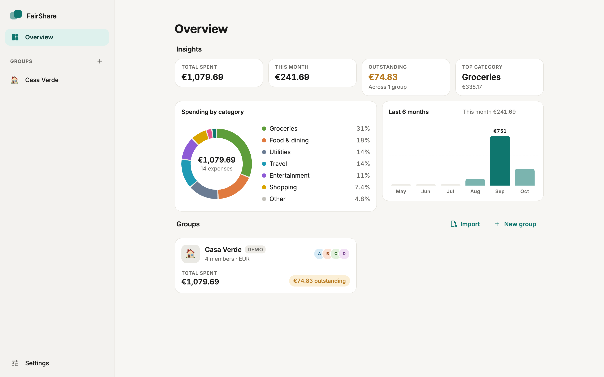
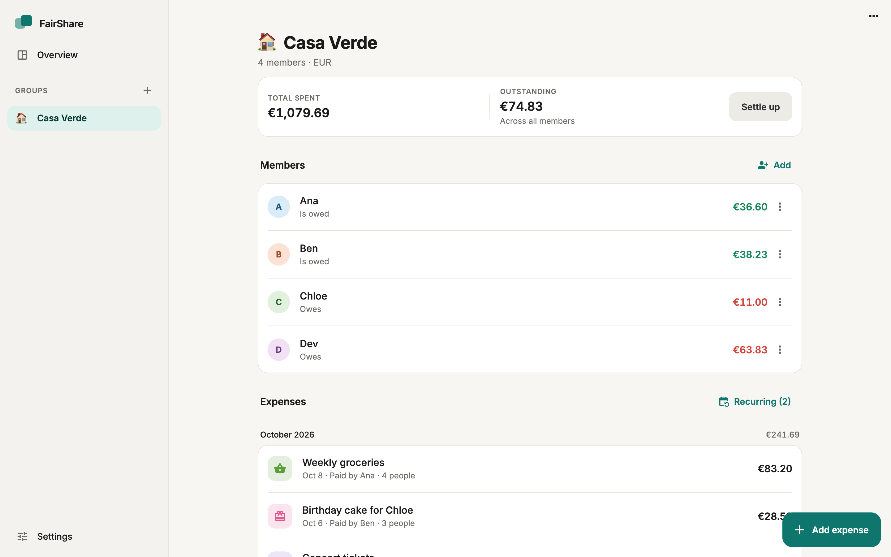
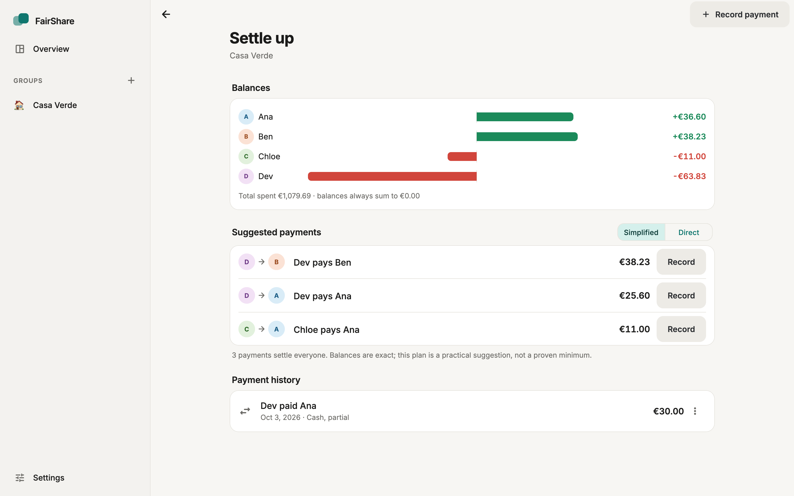
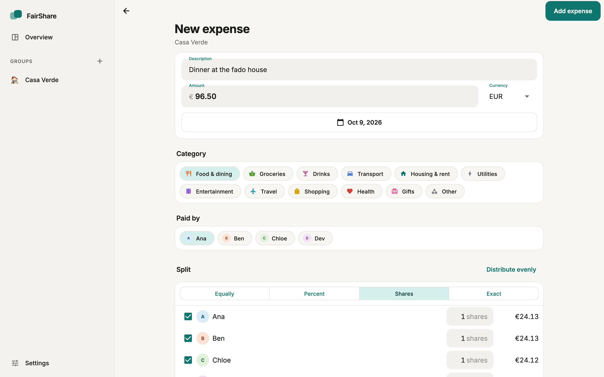
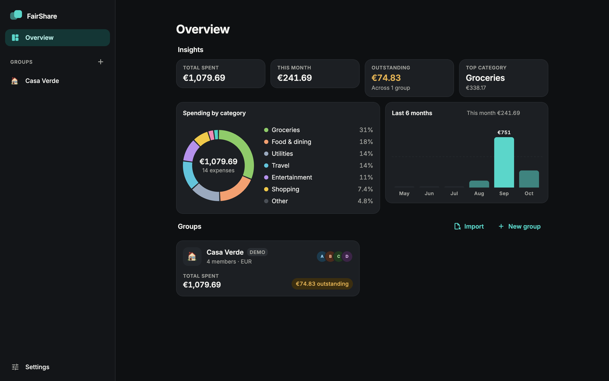
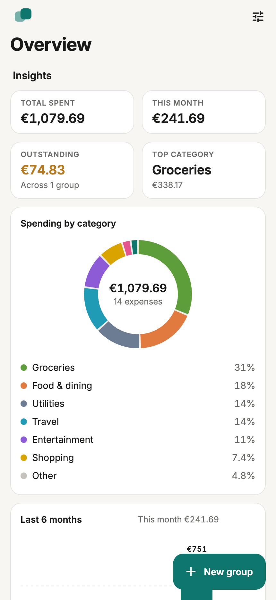
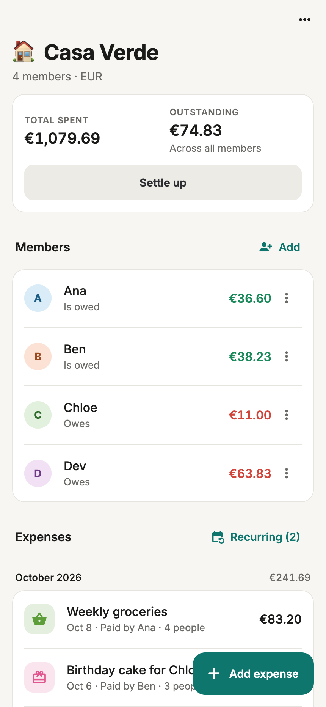

<p align="center">
  
</p>

<h1 align="center">FairShare</h1>
<p align="center"><strong>Split expenses, not friendships.</strong></p>
<p align="center">
  Offline-first expense sharing for roommates, friends, couples and group trips.<br>
  No account. No server. No telemetry. Exact integer accounting.
</p>

<p align="center">
  <a href="https://github.com/mateoosoriodelhonte/fairshare/actions/workflows/ci.yml"></a>
  <a href="https://github.com/mateoosoriodelhonte/fairshare/releases"></a>
  <a href="LICENSE"></a>
</p>

---

## Why FairShare

Most expense splitters want an account, a server and your phone number. FairShare wants none of that. It is a native desktop and mobile app that keeps a group's ledger in a local SQLite file, splits every bill with integer arithmetic (never floating point), and tells you honestly which numbers are exact and which are suggestions.

## Features

| | |
| --- | --- |
| **Groups and members** | Flats, trips, couples, clubs. Members are just names; no invitations. |
| **Four split modes** | Equal, by percentage, by shares, or exact amounts, with a live preview of every person's slice, including which ones get the leftover cent. |
| **Exact balances** | Every member's position is `paid + settled out − owed − settled in`, computed in minor currency units. The group always sums to zero; a property test proves it over random ledgers. |
| **Settle up** | A short list of suggested payments (exact-match pass + greedy matching, at most *k − 1* transfers) **or** the literal "who paid for whom" view. The app states plainly that the short list is practical, not proven minimal. |
| **Manual payments** | Record cash or bank transfers that happened outside the app. Partial payments leave the remainder visible. FairShare never moves money. |
| **Multiple currencies** | Each expense can be in any of 46 currencies; you type the rate to the group's base currency and it is stored with the record. Rates are never fetched. |
| **Recurring expenses** | Rent, internet, cleaning: daily to yearly templates that turn into ordinary, editable expenses on schedule. |
| **Insights** | Spending by category, a six-month trend, outstanding totals, per group and across groups. |
| **Export and import** | Versioned, human-readable JSON that round-trips exactly, plus CSV reports for expenses, balances and payments. Imports create a new group; nothing is ever overwritten. |
| **Demo group** | One tap creates "Casa Verde", a synthetic flat share that exercises every feature. It is never created unless you ask. |
| **Design** | Material 3 with a restrained, Apple-like feel: Inter typography with tabular figures, light and dark themes, a sidebar on desktop and stack navigation on phones, subtle motion that respects reduced-motion settings. |

<p align="center">
  
  
</p>
<p align="center">
  
  
</p>
<p align="center">
  
  
</p>

All screenshots show the synthetic demo group.

## Install

### macOS (release build)

1. Download the latest `FairShare-vX.Y.Z-macos.zip` from [Releases](https://github.com/mateoosoriodelhonte/fairshare/releases) and unzip it.
2. Move `FairShare.app` to Applications.
3. The bundle is ad-hoc signed and **not notarized** (no paid Apple developer account is used), so macOS blocks the first launch. Right-click the app and choose **Open**, or run:

   ```bash
   xattr -d com.apple.quarantine /Applications/FairShare.app
   ```

A SHA-256 checksum is attached to every release.

### From source

Requirements: Flutter 3.47 stable or newer; for macOS, Xcode with its licence accepted and CocoaPods.

```bash
git clone https://github.com/mateoosoriodelhonte/fairshare.git
cd fairshare
flutter pub get
flutter run -d macos
```

To rebuild the generated database code after changing `lib/data/db/tables.dart`:

```bash
./tool/codegen.sh
```

## Platform status

| Platform | Status |
| --- | --- |
| macOS | Built, unit/widget tested and integration tested in CI on every pull request. Release artifacts come from the same pipeline. |
| iOS, Android | Project folders exist and nothing in the code is desktop-only, but **neither has been built or tested**. |
| Windows, Linux, web | Not configured. |

Full detail, including functional limits, is in [docs/LIMITATIONS.md](docs/LIMITATIONS.md).

## Financial correctness

* `Money` is an integer count of minor units plus a currency. Parsing rejects over-precise input (`1.234` USD) instead of rounding it.
* Splits use deterministic integer allocation: equal splits hand leftover units to the first participants; weighted splits use the largest-remainder method. Shares are stored with the expense, so a saved bill never changes meaning.
* Foreign-currency expenses are converted once on the total with a user-entered fixed-point rate (six decimals, half-up rounding) and then re-split in the base currency, so balances always conserve value.
* Balances are exact accounting. Settlement suggestions are an optimisation layer on top and are labelled as such in the UI.

Read [docs/ARCHITECTURE.md](docs/ARCHITECTURE.md) for the algorithms and their guarantees, and [docs/DATA_FORMAT.md](docs/DATA_FORMAT.md) for the export schema.

## Testing

```bash
flutter analyze --fatal-infos
flutter test                                   # unit + widget tests
flutter test integration_test/app_test.dart -d macos
```

| Suite | What it covers |
| --- | --- |
| `test/core` | Money parsing/formatting across 0-, 2- and 3-decimal currencies, rate conversion, overflow safety |
| `test/domain` | Allocation and splitting (incl. seeded property tests), balance conservation on random mixed-currency ledgers, pairwise debts, debt simplification guarantees, recurrence rules, insights |
| `test/data` | Drift repositories on an in-memory database: round-trips, cascades, constraint enforcement, recurring generation, the demo seeder |
| `test/io` | JSON codec round-trips and a rejection matrix with element paths, CSV escaping and content, importer id remapping |
| `test/widget` | The real app driven against an in-memory database: groups, members, expense editor validation, settlements, recurring templates, export/import with a fake file gateway, demo group, insights, phone and large-text layouts, semantics |
| `integration_test` | The first flow end to end in a real macOS window; a screenshot capture used for this README |

CI runs analysis, formatting, generated-code verification and the test suite on Linux, and the integration tests plus a release build on macOS. The badge above reflects `main`.

## Privacy

FairShare makes no network requests. There are no accounts, no sync, no analytics and no crash reporting. The database lives in the app's sandboxed application-support directory; exports are written only where you choose in the save panel. The repository contains no real financial data; the demo group is invented.

## Architecture at a glance

```
lib/core        Money, Currency, ConversionRate          pure Dart
lib/domain      models, allocation, balances, settlement  pure Dart, property-tested
lib/data        Drift schema, repositories, demo seeder   SQLite
lib/io          JSON codec, importer, CSV, file gateway
lib/app         Riverpod providers, router, bootstrap
lib/ui          theme, shell, widgets, charts
lib/features    dashboard, groups, expenses, settlements, recurring, settings, io, demo
```

## Contributing

See [CONTRIBUTING.md](CONTRIBUTING.md). Issues and pull requests are welcome; the V1 scope is tracked in the [V1 milestone](https://github.com/mateoosoriodelhonte/fairshare/milestone/1).

## License

MIT. Inter is bundled under the SIL Open Font License (see `assets/fonts/LICENSE-Inter.txt`).
